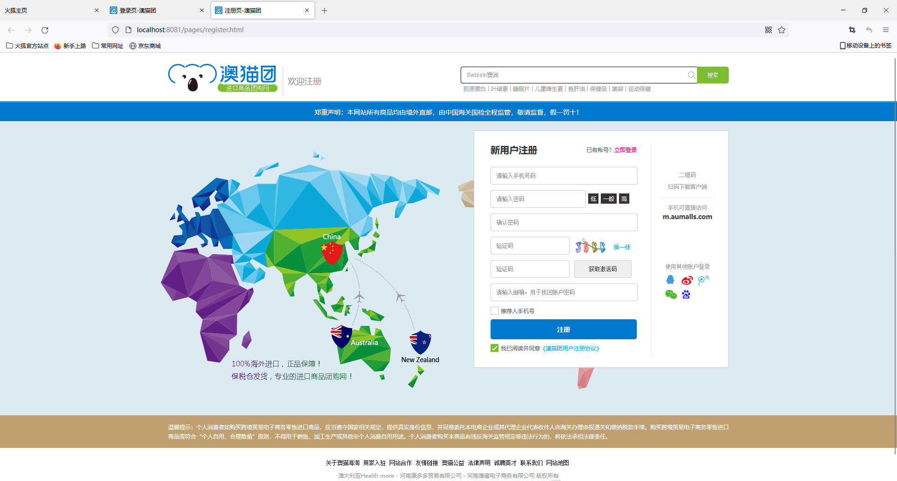
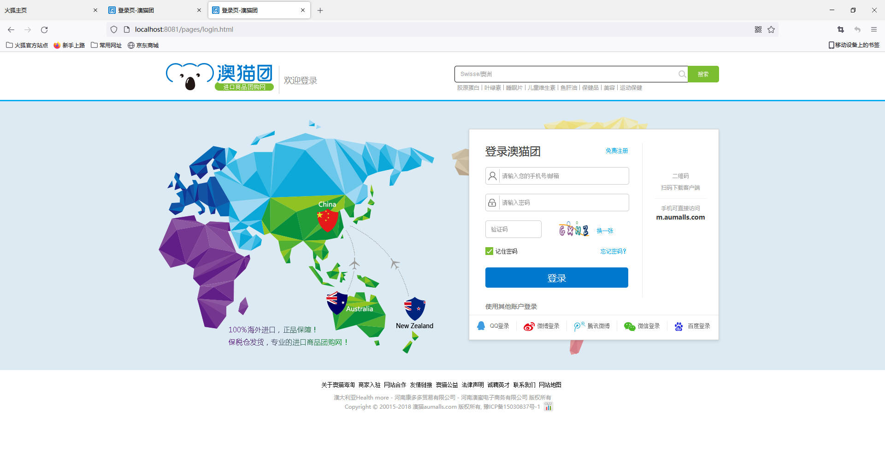
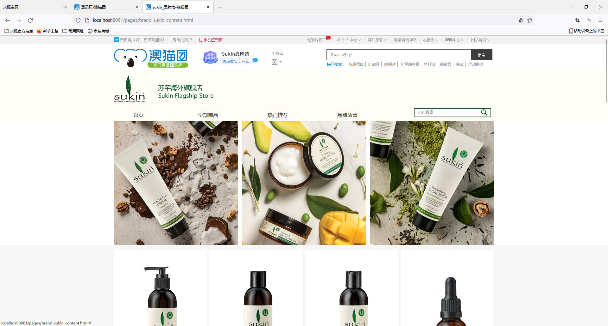
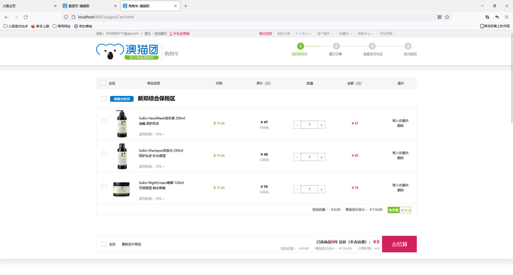
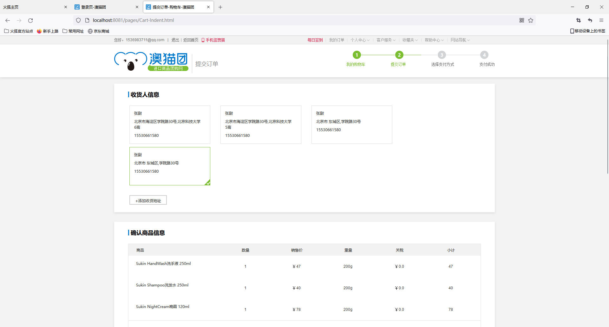
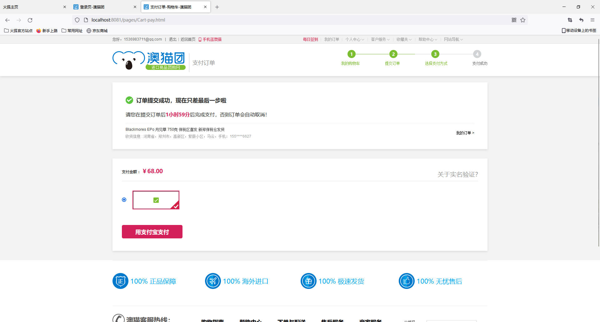
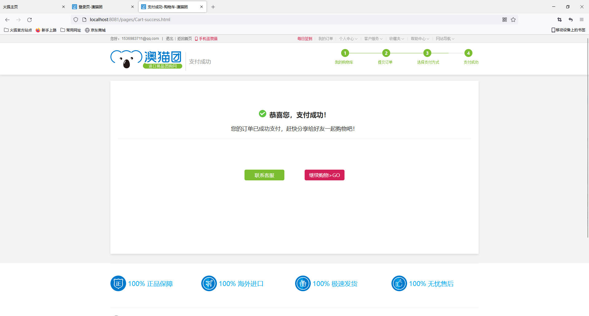
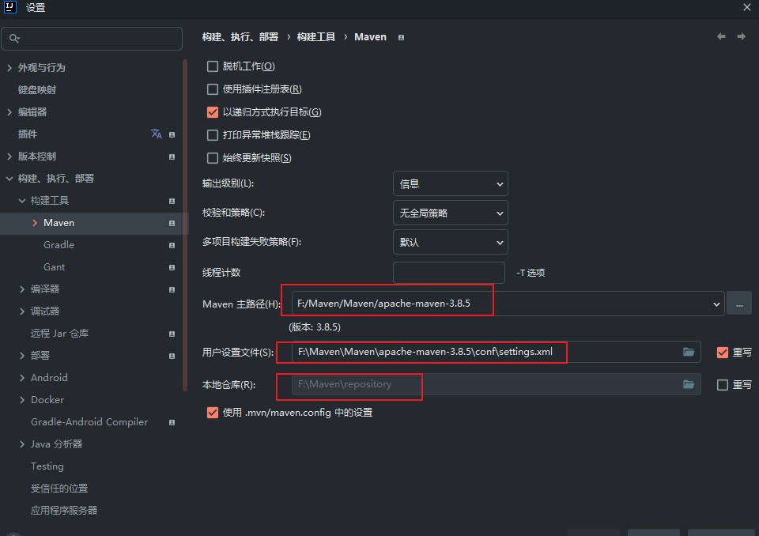
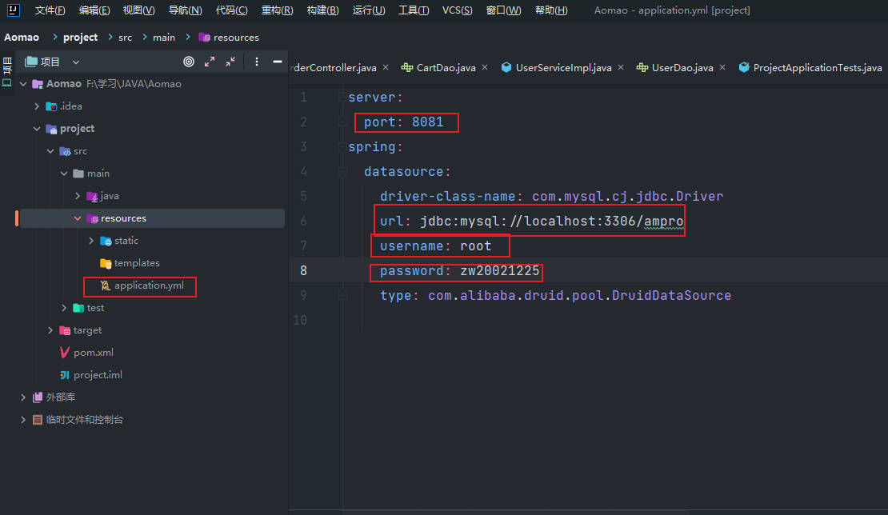

# 澳猫团购物平台项目

**@author: Captainzw**

**@create: 2022/7/20**

## 实现技术

### 前端

- 根据老师提供的html,css,js,image的基础上进行了修改

- js中主要使用jQuery完成时间绑定，动态添加元素

- 利用ajax和后端进行数据交互，ajax全部采用post方式

### 后端

- JDK11

- 项目管理Maven
- 数据库管理mybatis
- 框架spring+springMVC+springBoot
- 验证码工具easy-captcha和Json工具fastjson

## 实现效果

### 注册功能

- 手机号的非空和重复检测
- 密码的非空和两次输入不同的检测
- 验证码功能
- 邮箱可空

### 登录功能

- 手机邮箱登录均可
- 验证码功能

### 购物功能

- 商品选购
- 购物车显示数量

### 购物车功能

- 选择结算物品
- 删除物品
- 商品价格计算

### 结算功能

- 收货人地址记录功能
- 新增地址功能
- 确认商品信息功能
- 商品计价功能
- 提交订单功能

### 付款功能

- 并不能真正付款
- 只能点击用支付宝支付跳转到下一个页面

### 支付成功

- 只能点击继续购物回到购物功能
- 如果商品订单结算了，那么清空购物车

## 项目构建方法

由于使用了springBoot搭建项目，配置十分简单

### 数据库

先要配置数据库

使用navicat创建一个数据库，名字叫做`ampro`，也可以改成自己的名字

点击进入数据库，创建一个query(查询)，把文件`sql.sql`中的内容复制粘贴然后执行，如果执行过程中没有错误则执行正确

### 刷新Maven

在设置中的maven中更改为自己的maven路径和仓库

然后进入pom.xml，右上角刷新pom设置，没有报错则证明依赖导入成功

### 配置文件

主要以下几点：

- 修改Tomcat端口

- 修改数据库名

- 修改数据库用户名和密码

  

  在**resources文件夹下的application.yml文件下**

  - port 更改端口
  - url 更改数据库名，如果mysql端口是3306的话只需要更改`ampro`这一项，如果数据库名字也是`ampro`则不用更改
  - username和password处改为自己的账号密码

### 运行程序

运行程序观察效果，如果全部正常运行则运行成功

## 源码分析

敬请期待