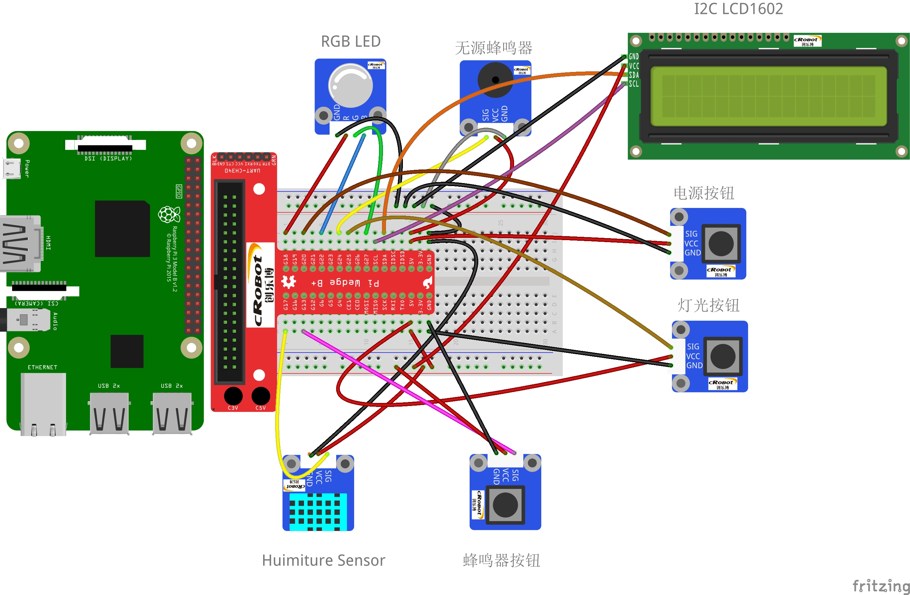
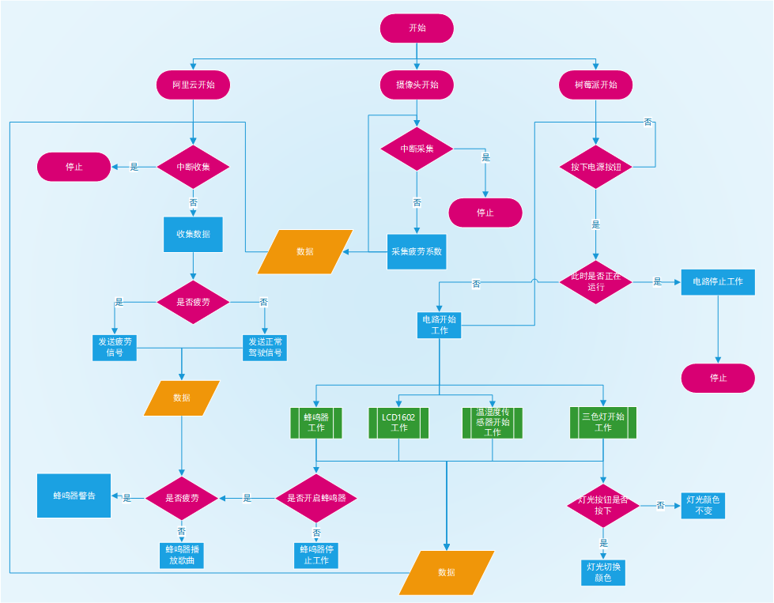
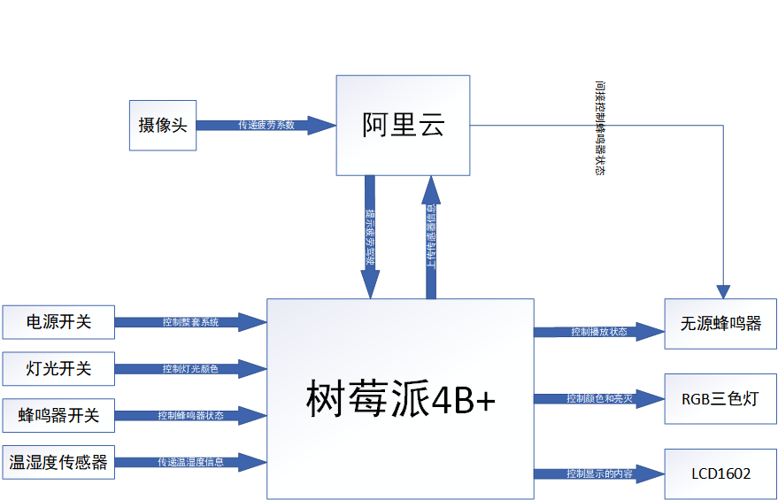

# 电子技术实习大作业

### 作品名称：带有疲劳驾驶检测系统的汽车多媒体设备

由两部分组成，分别是中期作业：汽车多媒体系统，大作业补充部分：疲劳驾驶检测与传递

*仅用于借鉴，严禁抄袭*

### 运行方法

汽车多媒体功能不过多介绍

疲劳驾驶检测需要的库：

- collections
- scipy
- numpy
- argparse
- dlib
- cv2

除此之外还需要下载dlib中的shape predictor做人脸的68个关键点检测

网址：http://dlib.net/files/  最下面shape_predictor_68_face_landmarks.dat

放入py文件同一目录下

运行python 文件参数

-i "文件路径" 一张具有人脸的图片（主要用于测试用，程序正常运行不需要，可以删除）

-p "shape_predictor_68_face_landmarks.dat" （人脸预测器，必须传参，不能删除）

运行main2.py是运行的疲劳驾驶代码

想要向阿里云上传递信息运行control.py(开两个线程，注意更改阿里云中的三元组信息等)

### 原理

大致原理为：

1. 先人脸关键点定位
2. 前一段时间先进行资料收集，眼睛嘴巴大小
3. 眼睛嘴巴大小明显偏离平均值时增加疲劳系数
4. 疲劳系数大于一定值时开启疲劳驾驶

计算眼睛嘴巴大小的方法见代码

### 图片

接线图：

流程图:

硬件结构图：

