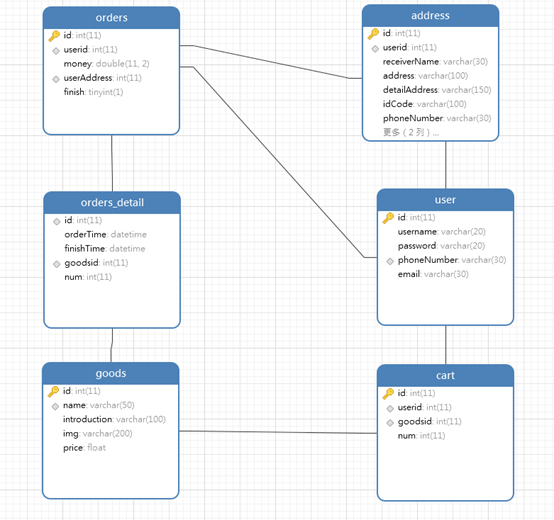
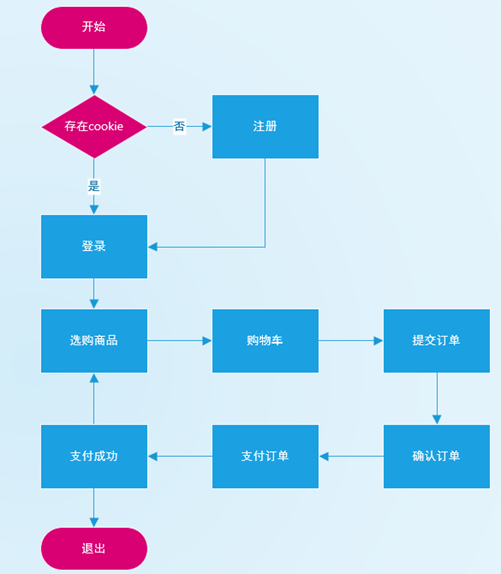
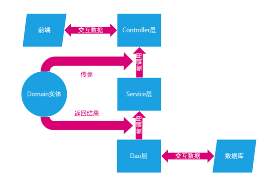

# 澳猫团购物平台项目

**@author: Captainzw**

**@create: 2022/7/20**

## 实现技术

### 前端

- 根据老师提供的html,css,js,image的基础上进行了修改

- js中主要使用jQuery完成时间绑定，动态添加元素

- 利用ajax和后端进行数据交互，ajax全部采用post方式

### 后端

- JDK11

- 项目管理Maven
- 数据库管理mybatis
- 框架spring+springMVC+springBoot
- 验证码工具easy-captcha和Json工具fastjson

## 实现效果

### 注册功能

- 手机号的非空和重复检测
- 密码的非空和两次输入不同的检测
- 验证码功能
- 邮箱可空

### 登录功能

- 手机邮箱登录均可
- 验证码功能

### 购物功能

- 商品选购
- 购物车显示数量

### 购物车功能

- 选择结算物品
- 删除物品
- 商品价格计算

### 结算功能

- 收货人地址记录功能
- 新增地址功能
- 确认商品信息功能
- 商品计价功能
- 提交订单功能

### 付款功能

- 并不能真正付款
- 只能点击用支付宝支付跳转到下一个页面

### 支付成功

- 只能点击继续购物回到购物功能
- 如果商品订单结算了，那么清空购物车

## 项目构建方法

由于使用了springBoot搭建项目，配置十分简单

### 数据库

先要配置数据库

使用navicat创建一个数据库，名字叫做`ampro`，也可以改成自己的名字

点击进入数据库，创建一个query(查询)，把文件`sql.sql`中的内容复制粘贴然后执行，如果执行过程中没有错误则执行正确

### 刷新Maven

在设置中的maven中更改为自己的maven路径和仓库

然后进入pom.xml，右上角刷新pom设置，没有报错则证明依赖导入成功

### 配置文件

主要以下几点：

- 修改Tomcat端口

- 修改数据库名

- 修改数据库用户名和密码

  

  在**resources文件夹下的application.yml文件下**

  - port 更改端口
  - url 更改数据库名，如果mysql端口是3306的话只需要更改`ampro`这一项，如果数据库名字也是`ampro`则不用更改
  - username和password处改为自己的账号密码

### 运行程序

运行程序观察效果，如果全部正常运行则运行成功

## 设计分析

### 总体设计

** 数据库设计：**用户地址address表、购物车cart表、商品goods表、订单orders表、订单详情orders_detail表、用户user表

** 前端页面设计：**注册页面、登录页面、商品选购页面、购物车界面、提交订单页面、支付页面、支付成功页面对应的html,css,js文件和image图片

** 后端设计：**实体类Domain模块，控制层Controller模块，，持久层Dao模块，服务层Service模块

### 概要设计

**数据库：**

用户地址address表有主键：id,自增长，记录用户id的userid键，记录收货人的receiverName键，记录收货地址的address键，记录详细收货地址的detailAddress键，记录身份证号码的idCode键，记录手机号的phoneNumber键，记录座机的landLine键，记录是否设置为默认地址的defaultAddress键

购物车cart表有主键:id,自增长，记录用户id的uerId键，记录商品id的goodsId键，记录商品数量的num键

商品goods表有主键：id，自增长，记录商品名称的name键，记录商品介绍的introduction键，记录商品图片位置的img键，记录商品价格的price键

订单orders表有主键id,自增长，记录该订单所属用户的userId键，记录订单价格总计的money键，记录用户地址的userAddress键，记录订单是否已经完成的finish键，

订单orders表有主键id,自增长，记录用户下订单时间的orderTime键，记录完成订单支付的时间finishTime键，订单购买的商品id的goodsId键，购买商品数量的num键

用户user表有主键: id,自增长，记录用户名的username键，记录密码的password键，记录手机号的phoneNumber键，记录邮箱的email键

数据库外键约束关系：address表中的userId必须来自user表中的id 。Orders表中的uerId必须来自user表中的id，userAddress必须来自address表中的id。Order_detail表中的id必须来自order表中的id，goodsId必须来自goods表中的id。Cart表中的userid必须来自user表中的id，goodsId必须来自goods中的id。

​                               

**前端页面设计：**

Register.html页面中主要包含了一个form表单，用来提供注册功能所需的信息，收集电话号、密码、确认密码、验证码、邮箱信息。通过register.js中进行正则表达式匹配，字符串匹配等方法确认表单内容的正确，并且通过ajax进行表单异步提交从而验证手机号的注册是否重复。并且通过ajax将收集到的信息提交到后端进行验证并返回信息，正确则跳转到登录界面。

Login.html页面包含了一个主要form表单可以收集电话号或者邮箱，邮箱，验证码，从而能够将收集到的信息提交到后端判断是否可以进入到商品选购的页面。

Brand_sukin_content.html页面是主要的购物页面，左上角可以显示登陆者的手机号信息，包含的内容有，从后端取到的商品信息，并进行动态展示，同时利用js实现点击商品可以利用ajax传到后端进行交互，交互成功后将商品加入购物车的功能，此时购物车的商品个数加一，点击我的购物车按钮可以跳转到购物车页面。

Cart.html页面可以通过ajax从后端中取出购物车中的信息，展示刚才加入到购物车的商品信息，并且能够实现对商品数量的增减或删除，选择购物车的部分或全部商品加入到订单中并计算价格的功能，主要通过ajax获取ul元素中的li的索引，根据其索引返回商品的id，传入到后端从而进行订单的添加，点击去结算可以跳转到订单结算页面。

Cart-indent.html页面可以通过ajax从后端取得用户添加过的收货地址信息和商品的订单情况信息并展示在页面上，也可以添加收货地址并获取表单元素后传入后端进行地址的添加，点击提交订单可以跳转到支付页面

Cart-pay.html页面显示的是支付页面，可以显示提交订单的信息和总金额，点击支付按钮可以进行支付。

Cart-success页面显示的是支付成功的页面，可以点击继续购物回到购物页面，此时的购物车已经被清零了。

 

**后端设计：**

Controller模块中我设计了AddressController,OrderController和UserController三个主要的控制类，分别用来处理关于地址，订单和用户的增删改查的功能，还设计了一个Code类来规定增删改查的成功或失败，分别用不同的数值常量来表示，还有一个Result类，所有controller的返回类型均为result,他是一个对象，包括了功能处理状态：code,返回信息:data和附带信息:msg。实现的部分功能有：生成验证码并返回到前端，并且把验证码信息存储到session中，等待前端传递过来的form表单从而进行判断验证码是否正确。查询数据库中是否已经存在用户想要注册的手机号，根据结果返回到前端，根据前端传递过来的信息插入购物车，订单，地址等功能。

Dao层主要是实现利用mybatis的mapper代理开发功能，对数据库中的内容进行增删改查，分别由AddressDao,UserDao,CartDao和orderDao，分别对应不同的数据库，使用注解开发的方法实现了insert,update,select,delete等语句。

Domain层是实体类，用来接收和描述实体，例如Address,Cart,Goods,OrderDetail,User类，与数据库中的内容一一相对，用来接收数据库的信息或写入数据库之前的实体。

Service层主要是实现对Dao层的调用，实现业务逻辑，并提供给controller层进行调用，实现了接口AddressService,CartService,OrderService,UserService和他们的实现类。

 

## 源码分析

敬请期待