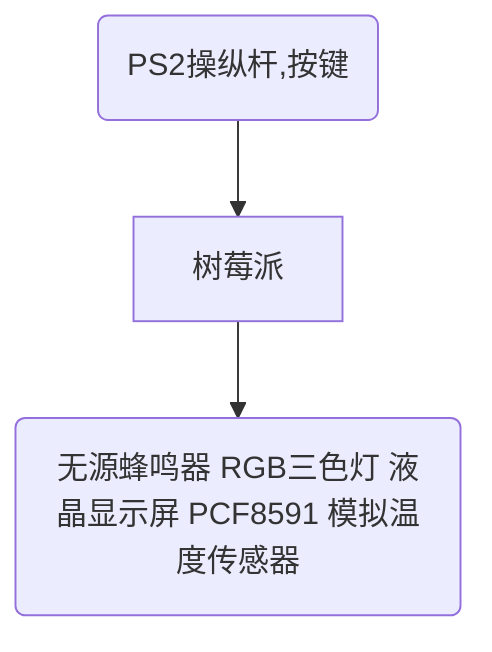
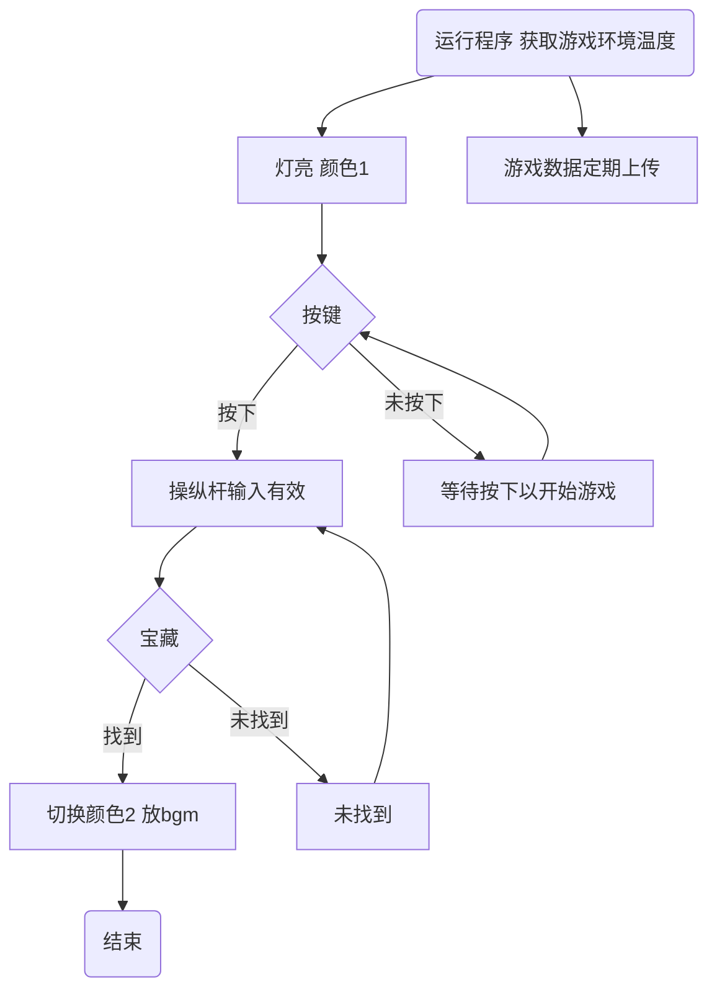
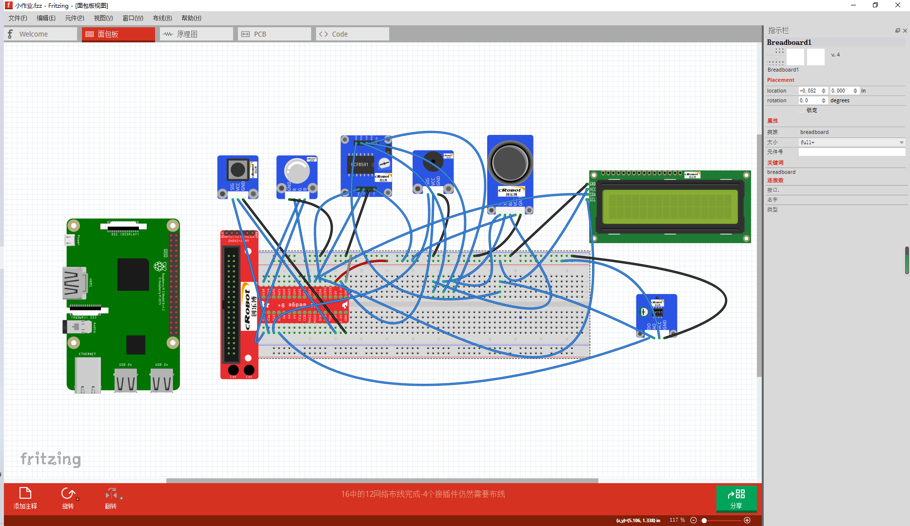
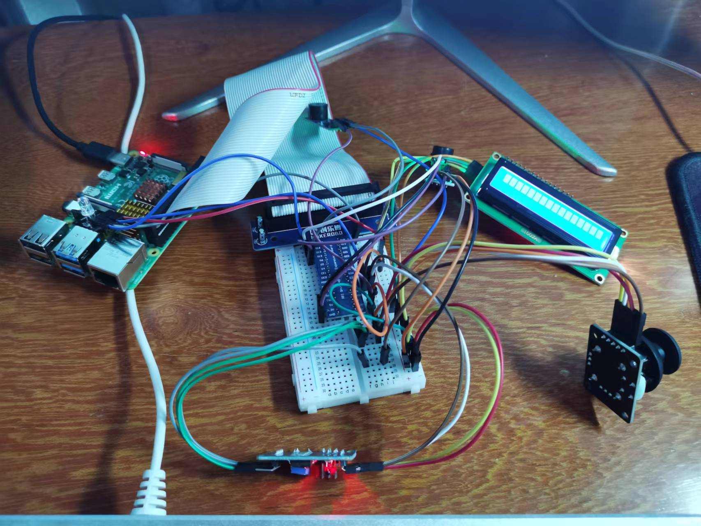
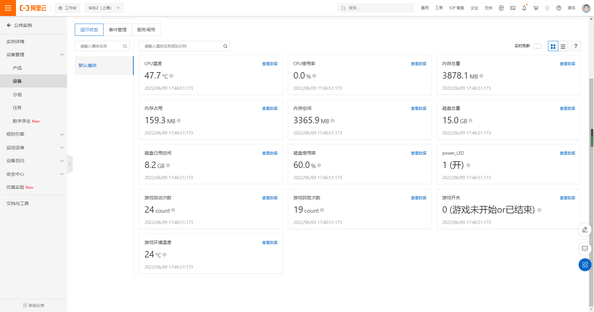

# 北京科技大学《电子技术实习》 大作业

[TOC]

## 零，制作人员基本信息

    作品名称：find_the_treasure_v2.0
    组号：小组xx
    姓名：zyz
    同组人员：xxx
    班级：xxx
    学院：xxx学院
    联系方式：xxx
    提交日期：2022年6月x日

## 一，作品内容介绍

### 1.作业名称

    小游戏-find_the_treasure_v2.0
### 2.使用模块（6个）及其作用说明

    1.PCF8591（模数信号转换）；
    2.RGB三色灯（进入游戏显示颜色1，找到宝藏后显示颜色2）；
    3.按键开关一个（确认是否开始游戏，只有当按下按键之后才可以开始游戏，使用操纵杆）；
    4.PS2操纵杆（控制当前人物坐标，实现上下左右移动）；
    5.液晶显示屏（显示当前人物坐标点及其相关信息）；
    6.无源蜂鸣器（在找到宝藏之后播放bgm）；
    7.模拟温度传感器（获取当前游戏环境的温度）；
### 3.主要设计思路及功能说明

    	首先需要在源代码里设置地图范围大小（比如5x5大小的地图），然后设置宝藏点的位置（比如x=2，y=3为宝藏坐标点），随后就可以进入游戏了（运行代码）。按下按键开关后（若不按下则操纵杆无效），通过控制PS2操纵杆实现人物的上下左右移动，并通过显示器显示当前人物坐标及其相关信息，当找到宝藏之后（即当前坐标为宝藏坐标时）RGB三色灯会切换颜色，无源蜂鸣器会播放bgm。在程序运行期间模拟温度传感器会不断获取当前游戏环境温度。
### 4.结合阿里云云端数据上传进行说明

    	在开始游戏前，我们需要先运行run.py进行树莓派数据云端上传，建立树莓派与阿里云云端的连接。然后运行main.py启动我们的游戏。然后我们就可以尽情游玩我们制作的游戏，树莓派则会将树莓派自身系统的相关数据如：cpu使用率，cpu温度等等，以及游戏相关数据如：游戏已启动次数，游戏获胜次数，游戏当前环境温度等等上传至我们的阿里云云端。
## 二，硬件框图



## 三，程序流程图


## 四，作品接线图表

### 接线表
| 模数转换（PCF8591) | 树莓派 | T型转接板 | RGB LED模块 |无源蜂鸣器|PCF8591|按键开关|温度模拟传感器|液晶显示器|PS2操纵杆|
| ------ | --------- | ----------- | ------ | ------ | ------ | ------ | ------ | ------ | ------ |
|| GPIO.0 | GPIO17    | R           |||||||
|| GPIO.1 | GPIO18    | G           |||||||
|| GPIO.2 | GPIO27    | B           |||||||
|| GPIO.23 | GPIO13 |  |I/O||||||
|| GPIO.26 | GPIO12 |  ||||DO|||
|| GPIO.27 | GPIO16 |  |||OUT||||
|| SCL | SCL |  ||SCL|||SCL||
|| SDA | SDA |  ||SDA|||SDA||
|AOUT|  | | |||||||
|AIN0|  |  | ||||||VRY|
|AIN1|  | | ||||||VRX|
|AIN2|  | | ||||||SW|
|AIN3|  | | ||||AO|||
|| 3.3V |  |  |VCC||||||
|| 5V |  |  ||VCC|VCC|VCC|VCC|VCC|
|| GND    | GND       | GND         |GND|GND|GND|GND|GND|GND|


### 接线图


## 五，实物图展示



## 六，数据上云展示



## 七，作品视频展示

```
见外部视频文件（视频展示.mp4）
```

## 八，源代码（pdf中只展示有改动的代码文件）

### 游戏主程序代码

```
#!/usr/bin/env python3
# -*- coding: utf-8 -*-
# －－－－电子技术实习小作业2－－－－
#  文件名：main.py
#  版本：V2.0
#  author: 曾绎哲，丁一铭
# 说明：小游戏--找宝藏(升级版)
#####################################################

from glob import glob
from re import X
from tracemalloc import start
import PCF8591 as ADC
import LCD1602
import RPi.GPIO as GPIOX
import RPi.GPIO as GPIO
import time
import math

############全局变量##################
makerobo_DO = 32 # 温度传感器Do管脚
GPIO.setmode(GPIO.BOARD) # 管脚分配

#游戏次数统计
global game_start
global game_win
game_start=0
game_win=0

#当前坐标
global x
global y

#宝藏坐标
global aimedx
global aimedy
aimedx=2
aimedy=3

#地图范围
global xx
global yy
xx=5
yy=5

#蜂鸣器
makerobo_Buzzer = 33             # 无源蜂鸣器管脚定义

# 音谱定义
Tone_CL = [0, 131, 147, 165, 175, 196, 211, 248]		# 低C音符的频率
Tone_CM = [0, 262, 294, 330, 350, 393, 441, 495]		# 中C音的频率
Tone_CH = [0, 525, 589, 661, 700, 786, 882, 990]		# 高C音符的频率

# 第一首歌音谱
makerobo_song_1 = [	Tone_CH[1], Tone_CH[2], Tone_CM[5], Tone_CH[2], Tone_CH[3], Tone_CH[5], Tone_CH[4], Tone_CH[3],
                    Tone_CH[1], Tone_CH[1], Tone_CH[2], Tone_CM[5], Tone_CM[5], Tone_CM[5], Tone_CM[6], Tone_CH[1],
                    Tone_CM[6], Tone_CH[1], Tone_CH[1], Tone_CH[2], Tone_CM[5], Tone_CH[2], Tone_CH[3], Tone_CH[5],
                    Tone_CH[4], Tone_CH[3], Tone_CH[1]]
# 第1首歌的节拍，1表示1/8拍
makerobo_beat_1 = [	12, 12, 8, 12, 12, 2, 2, 2, 			
                    2, 12, 12, 8, 4, 2, 2, 2,
                    2, 2, 12, 12, 8, 12, 12, 2,
                    2, 2, 2	]

#RGB 三色LED
colors = [0x0FF000, 0x00FF00]
makerobo_R = 11
makerobo_G = 12
makerobo_B = 13

#按键
makerobo_BtnPin = 36 #轻触按键Pin端口
global judge #判断按键是否按下
judge=1
#########PS2部分######################
# 初始化
def makerobo_setup():
    ADC.setup(0x48)					# 设置PCF8591模块地址
    global makerobo_state           # 状态变量
    #温度传感器
    GPIO.setup(makerobo_DO, GPIO.IN) # 温度传感器DO端口设置为输入模式
    #蜂鸣器
    GPIOX.setmode(GPIOX.BOARD)		# 采用实际的物理管脚给GPIO口
    GPIOX.setwarnings(False)         # 关闭GPIO警告提示
    GPIOX.setup(makerobo_Buzzer, GPIOX.OUT)	# 设置无源蜂鸣器管脚为输出模式
    global makerobo_Buzz		    # 指定一个全局变量来替换gpi.pwm
    makerobo_Buzz = GPIOX.PWM(makerobo_Buzzer, 1)	# 设置初始频率为440。
    makerobo_Buzz.start(50)					# 按50%工作定额启动蜂鸣器引脚。
    #按键
    GPIO.setup(makerobo_BtnPin, GPIO.IN, pull_up_down=GPIO.PUD_UP)    # 设置BtnPin管脚为输入模式，上拉至高电平(3.3V)
    # 中断函数，当轻触按键按下时，调用detect函数
    GPIO.add_event_detect(makerobo_BtnPin, GPIO.BOTH, callback=makerobo_detect, bouncetime=200)

#RGB三色LED
#初始化
def RGB_setup(Rpin, Gpin, Bpin):
    global pins
    global p_R, p_G, p_B
    pins = {'pin_R': Rpin, 'pin_G': Gpin, 'pin_B': Bpin}
    GPIO.setmode(GPIO.BOARD)        # 采用实际的物理管脚给GPIO口
    GPIO.setwarnings(False)         # 去除GPIO口警告
    for i in pins:
        GPIO.setup(pins[i], GPIO.OUT)   # 设置Pin模式为输出模式
        GPIO.output(pins[i], GPIO.LOW)  # 设置Pin管脚为低电平(0V)关闭LED
    p_R = GPIO.PWM(pins['pin_R'], 2000)  # 设置频率为2KHz
    p_G = GPIO.PWM(pins['pin_G'], 1999)
    p_B = GPIO.PWM(pins['pin_B'], 5000)
    # 初始化占空比为0(led关闭)
    p_R.start(0)
    p_G.start(0)
    p_B.start(0)
    f=open('/home/pi/Desktop/second_homework/button.txt','w',encoding='utf-8')
    f.write('0')
    f.close()

# 按比例缩放函数
def makerobo_pwm_map(x, in_min, in_max, out_min, out_max):
    return (x - in_min) * (out_max - out_min) / (in_max - in_min) + out_min

# 关闭RGB-LED灯
def makerobo_off():
    GPIO.setmode(GPIO.BOARD)   # 采用实际的物理管脚给GPIO口
    for i in pins:
        GPIO.setup(pins[i], GPIO.OUT)     # 设置Pin模式为输出模式
        GPIO.output(pins[i], GPIO.LOW)    #  设置Pin管脚为低电平(0V)关闭LED

# 设置颜色
def makerobo_set_Color(col):   #  例如:col  = 0x112233
    R_val = (col & 0xff0000) >> 16
    G_val = (col & 0x00ff00) >> 8
    B_val = (col & 0x0000ff) >> 0

    # 把0-255的范围同比例缩小到0-100之间
    R_val = makerobo_pwm_map(R_val, 0, 255, 0, 100)
    G_val = makerobo_pwm_map(G_val, 0, 255, 0, 100)
    B_val = makerobo_pwm_map(B_val, 0, 255, 0, 100)

    p_R.ChangeDutyCycle(100-R_val)     # 改变占空比
    p_G.ChangeDutyCycle(100-G_val)     # 改变占空比
    p_B.ChangeDutyCycle(100-B_val)     # 改变占空比

# 中断函数，有按键按下时，响应中断函数
def makerobo_detect(chn):
    makerobo_Print(GPIO.input(makerobo_BtnPin))       # 打印出GPIO的状态

# 打印函数，显示出按键按下
def makerobo_Print(x):
    if x == 0:
        print('*Game Started!*')
        global judge
        judge=0

# 方向判断函数
def makerobo_direction():	
    global x
    global y
    state = ['home', 'up', 'down', 'left', 'right', 'pressed']  # 方向状态信息
    i = 0
    if ADC.read(0) <= 30:
        i = 1		# up方向
        y=y+1
    if ADC.read(0) >= 225:
        i = 2		# down方向
        y=y-1
    if ADC.read(1) >= 225:
        i = 4		# right方向
        x=x+1
    if ADC.read(1) <= 30:
        i = 3		# left方向
        x=x-1
    if ADC.read(2) == 0 and ADC.read(1) == 128:
        i = 5		# Button按下
        print('Ready to reset!')
        x=0
        y=0
        print('Reseted!')
    # home位置
    if ADC.read(0) - 125 < 15 and ADC.read(0) - 125 > -15	and ADC.read(1) - 125 < 15 and ADC.read(1) - 125 > -15 and ADC.read(2) == 255:
        i = 0
    return state[i]   # 返回状态

# 循环函数（主要功能函数）
def makerobo_loop():
    global game_start
    game_start=game_start+1
    #获取温度
    makerobo_status = 1   # 状态值
    makerobo_tmp = 1      # 当前值
    makerobo_analogVal = ADC.read(0) # 读取AIN0上的模拟值
    makerobo_Vr = 5 * float(makerobo_analogVal) / 255 # 转换到5V范围
    makerobo_Rt = 10000 * makerobo_Vr / (5 - makerobo_Vr)
    makerobo_temp = 1/(((math.log(makerobo_Rt / 10000)) / 3950) + (1 / (273.15+25)))
    makerobo_temp = int(makerobo_temp - 273.15)
    print ('temperature = ', makerobo_temp, 'C')
    makerobo_tmp = GPIO.input(makerobo_DO) # 读取温度传感器数字端口
    f=open('/home/pi/Desktop/second_homework/temp.txt','w',encoding='utf-8')
    f.write(str(makerobo_temp))
    f.close()
    time.sleep(0.2)                     # 延时 200ms
    #游戏内容
    makerobo_status = ''    # 状态值赋空值
    LCD1602.init(0x27, 1)	# init(slave address, background light)
    while True:
        #LCD1602.init(0x27, 1)	# init(slave address, background light)
        makerobo_set_Color(colors[0])  # 设置颜色,初始颜色
        if judge==0:
            f=open('/home/pi/Desktop/second_homework/button.txt','w',encoding='utf-8')
            f.write('1')
            f.close()
            makerobo_tmp = makerobo_direction()   # 调用方向判断函数
            if makerobo_tmp != None and makerobo_tmp != makerobo_status:  # 判断状态是否发生改变
                print (makerobo_tmp) # 打印出方向位
                makerobo_status = makerobo_tmp # 把当前状态赋给状态值，以防止同一状态多次打印
                #显示屏显示坐标
                tempx=str(x)
                tempy=str(y)
                LCD1602.clear()
                LCD1602.write(0, 0, 'x='+tempx+' y='+tempy)
                LCD1602.write(1, 1, 'NULL')
                if abs(x)>xx or abs(y)>yy:
                    LCD1602.clear()
                    LCD1602.write(0, 0, 'x='+tempx+' y='+tempy)
                    LCD1602.write(1, 1, 'Error.Crossed!') #人物越界，游戏失败
                    break
                else:
                    if x==aimedx and y==aimedy: #判断是否走到宝藏点
                        makerobo_set_Color(colors[1])#切换颜色，找到宝藏颜色
                        #显示器显示
                        LCD1602.clear()
                        LCD1602.write(0,0,'x='+tempx+' y='+tempy)
                        LCD1602.write(1,1,'You Got it!')
                        global game_win
                        game_win=game_win+1
                        #播放bgm
                        #for i in range(0, len(makerobo_song_1)):     # 播放第一首歌
                            #makerobo_Buzz.ChangeFrequency(makerobo_song_1[i]) # 设置歌曲音符的频率
                            #time.sleep(makerobo_beat_1[i] * 0.08)	 # 延迟一个节拍* 0.5秒的音符
                        break
                    time.sleep(0.3)
        else:
            #LCD1602.init(0x27, 1)	# init(slave address, background light)
            LCD1602.write(0,0,'Game has')
            LCD1602.write(1,1,'not started yet')
# 异常处理函数
def destroy():
    makerobo_Buzz.stop()			    # 停止蜂鸣器
    GPIOX.output(makerobo_Buzzer, 1)		# 设置蜂鸣器管脚为高电平
    GPIOX.cleanup()				        # 释放资源

    p_R.stop()      # 关闭红色PWM
    p_G.stop()      # 关闭绿色PWM
    p_B.stop()      # 关闭蓝色PWM
    makerobo_off()  # 关闭RGB-LED灯
    GPIO.cleanup()  # 释放资源
# 程序入口
if __name__ == '__main__':
    x=0
    y=0	
    f=open('/home/pi/Desktop/second_homework/Start.txt','r',encoding='utf-8')
    Start_=int(f.read())
    f.close()
    f=open('/home/pi/Desktop/second_homework/win.txt','r',encoding='utf-8')
    Win=int(f.read())
    f.close()
    game_start=Start_
    game_win=Win
    RGB_setup(makerobo_R, makerobo_G, makerobo_B)#初始化RGB
    makerobo_setup()  # 初始化主要功能
    try:
        makerobo_loop() # 调用循环函数
        f=open('/home/pi/Desktop/second_homework/Start.txt','w',encoding='utf-8')
        f.write(str(game_start))
        f.close()
        f=open('/home/pi/Desktop/second_homework/win.txt','w',encoding='utf-8')
        f.write(str(game_win))
        f.close()
        f=open('/home/pi/Desktop/second_homework/button.txt','w',encoding='utf-8')
        f.write('0')
        f.close()

    except KeyboardInterrupt:  	# 当按下Ctrl+C时，将执行destroy()子程序。
        destroy()   # 调用释放函数
```


### 数据上传代码

```
#!/usr/bin/python3

import aliLink,mqttd,rpi
import time,json
# 三元素（iot后台获取）
ProductKey = 'h5y0S2HMbXh'
DeviceName = 'raspberry-device'
DeviceSecret = "596ccca112cfb0596362dbf0ebedcb15"
# topic (iot后台获取)
POST = '/sys/h5y0S2HMbXh/raspberry-device/thing/event/property/post'  # 上报消息到云
POST_REPLY = '/sys/h5y0S2HMbXh/raspberry-device/thing/event/property/post_reply'
SET = '/sys/h5y0S2HMbXh/raspberry-device/thing/service/property/set'  # 订阅云端指令


# 消息回调（云端下发消息的回调函数）
def on_message(client, userdata, msg):
    #print(msg.payload)
    Msg = json.loads(msg.payload)
    switch = Msg['params']['PowerLed']
    rpi.powerLed(switch)
    print(msg.payload)  # 开关值

#连接回调（与阿里云建立链接后的回调函数）
def on_connect(client, userdata, flags, rc):
    pass


# 链接信息
Server,ClientId,userNmae,Password = aliLink.linkiot(DeviceName,ProductKey,DeviceSecret)

# mqtt链接
mqtt = mqttd.MQTT(Server,ClientId,userNmae,Password)
mqtt.subscribe(SET) # 订阅服务器下发消息topic
mqtt.begin(on_message,on_connect)


# 信息获取上报，每10秒钟上报一次系统参数
while True:
    time.sleep(10)
	#获取指示灯状态
    power_stats=int(rpi.getLed())
    if(power_stats==0):
        power_LED = 0
    else:
        power_LED = 1

    # CPU 信息
    CPU_temp = float(rpi.getCPUtemperature())  # 温度   ℃
    CPU_usage = float(rpi.getCPUuse())         # 占用率 %

    # RAM 信息
    RAM_stats =rpi.getRAMinfo()
    RAM_total =round(int(RAM_stats[0]) /1000,1)    #
    RAM_used =round(int(RAM_stats[1]) /1000,1)
    RAM_free =round(int(RAM_stats[2]) /1000,1)

    # Disk 信息
    DISK_stats =rpi.getDiskSpace()
    DISK_total = float(DISK_stats[0][:-1])
    DISK_used = float(DISK_stats[1][:-1])
    DISK_perc = float(DISK_stats[3][:-1])

    #Game 信息
    f=open('/home/pi/Desktop/second_homework/Start.txt','r',encoding='utf-8')
    Game_Start=int(f.read())
    f.close()
    f=open('/home/pi/Desktop/second_homework/win.txt','r',encoding='utf-8')
    Game_Win=int(f.read())
    f.close()
    f=open('/home/pi/Desktop/second_homework/button.txt','r',encoding='utf-8')
    Game_Button=int(f.read())
    f.close()
    f=open('/home/pi/Desktop/second_homework/temp.txt','r',encoding='utf-8')
    Game_Temperature=int(f.read())
    f.close()
    # 构建与云端模型一致的消息结构
    updateMsn = {
        'cpu_temperature':CPU_temp,
        'cpu_usage':CPU_usage,
        'RAM_total':RAM_total,
        'RAM_used':RAM_used,
        'RAM_free':RAM_free,
        'DISK_total':DISK_total,
        'DISK_used_space':DISK_used,
        'DISK_used_percentage':DISK_perc,
        'PowerLed':power_LED,
        #新添加数据
        'Game_Start':Game_Start,
        'Game_Win':Game_Win,
        'Game_Button':Game_Button,
        'Game_Temperature':Game_Temperature
    }
    JsonUpdataMsn = aliLink.Alink(updateMsn)
    print(JsonUpdataMsn)

    mqtt.push(POST,JsonUpdataMsn) # 定时向阿里云IOT推送我们构建好的Alink协议数据
```

## 九，小组分工

### 曾绎哲

	在大作业中完成应用的设计以及大部分的代码编写，实现应用功能，并撰写答辩ppt以及最终的实验报告。
### 丁一铭

	在大作业中协助应用的实现以及代码编写，测试应用中的bug，并协助完成答辩ppt以及最终的实验报告。


## 十，心得体会

### 曾绎哲

      通过此次的实验，我们学会了这些基本模块的基本工作原理以及其如何实现他们进行工作的python代码逻辑。在仔细阅读研究其python代码之后，基本上就知道了该如何控制其工作；在仔细研究其电路接线原理之后，基本上就知道了该如何在面包板上进行接线，知道了该如何将几个模块的功能串联起来。
      在设计大作业的过程中，难免会遇到一些技术问题，但只要经过细心阅读相关文件的代码，并且大胆地一步一步地进行尝试，就可以解决大部分的问题。而至于另外一小部分问题，我们可以采用改变思路的方式进行解决。有时候要做到同一个效果，并不一定只有一条道路可走，绕一条路，也同样可以到达“罗马”。
      此次的大作业是在之前的小作业的基础上将下游戏进行了进一步的完善与修改，并且实现了数据的云端上传，这是本次大作业最大的特点，也是游戏开发中非常重要的一步，也是将一款游戏真正投入市场的重要一步。
      总的来说，此次的大作业让我学会了很多的东西，不仅仅是树莓派的相关知识，各类传感器模块的使用，还有如何开发出一个应用的设计思路，这是我认为本次作业的最大价值所在。

### 丁一铭